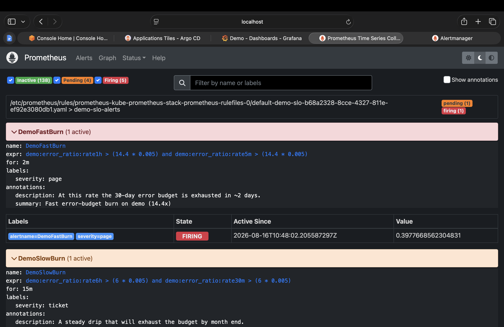
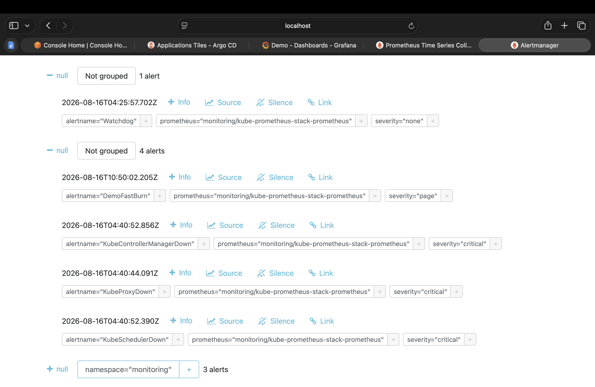
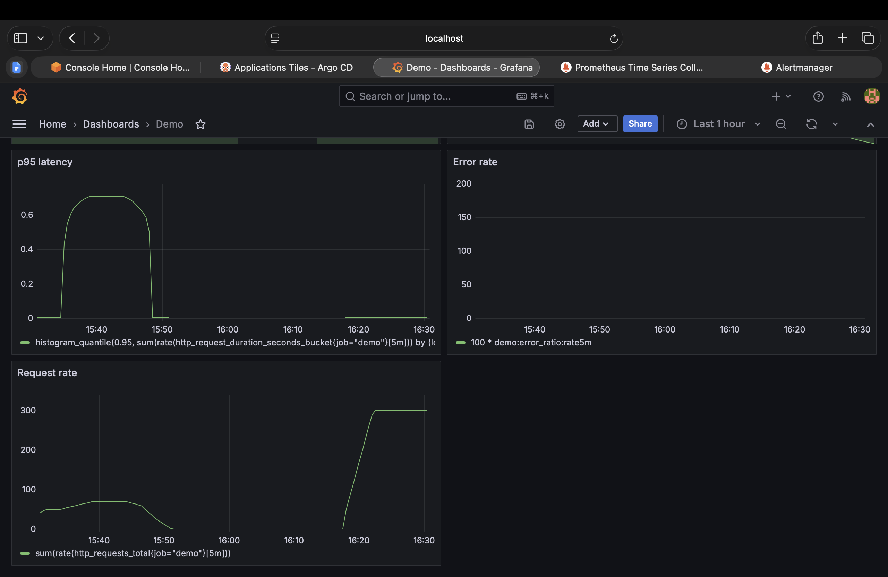
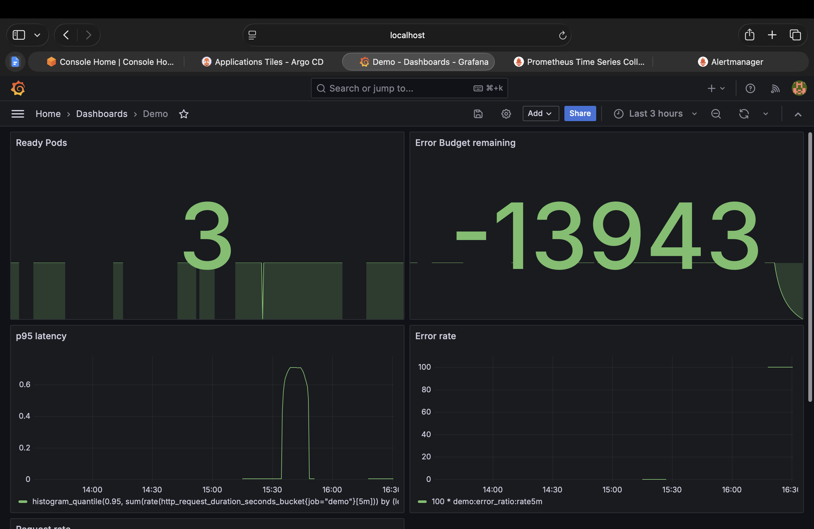

# Postmortem — Induced error-budget burn, 2026-08-16

**Status:** Resolved
**Severity:** SEV-2 (simulated — planned reliability validation)
**Author:** Prashanth
**Service:** `demo` (Internal Developer Platform)

---

## Summary

During a scheduled reliability validation exercise, HTTP 5xx traffic was injected
into the `demo` service to verify that SLO-based burn-rate alerting behaves as
designed. The service returned errors for approximately 20 minutes at a peak
1-hour error ratio of 95%. The fast-burn alert fired **4 minutes** after
injection began and resolved **~5 minutes** after injection stopped. Two
additional experiments — pod termination under load, and latency injection —
were run alongside. No production users were affected.

The exercise validated the alerting design and surfaced four defects, all
captured as action items below.

---

## Impact

| Measure | Value |
|---|---|
| Peak 1h error ratio | **94.9%** (fast-burn threshold: 7.2%) |
| Duration above threshold | ~20 minutes |
| Detection latency | **4 minutes** (injection → FIRING) |
| Recovery latency | **~5 minutes** (fix → RESOLVED) |
| Peak p95 latency (separate experiment) | **0.70s** vs 200ms SLI target |
| User impact | None — synthetic traffic only |

### Error budget arithmetic

The SLO is **99.5% availability over a rolling 30 days**, giving an error budget
of 0.5% — equivalent to **3h 39m** of full-outage time per month.

Injection ran at ~300 req/s for ~20 minutes with a 100% error rate, so
approximately **360,000 failed requests**. At a burn rate of ~190× the
sustainable pace, this window alone consumed a substantial fraction of the
monthly budget — the 6-hour error ratio remained above 9% well after injection
stopped.

The exact percentage is not meaningful here because the service carries no
organic production traffic; the denominator is entirely synthetic. **This is
itself a finding:** ratio-based SLIs are diluted by volume, and a low-traffic
service produces volatile budget figures.

---

## Timeline

All times IST (UTC+5:30), 2026-08-16.

| Time | Event |
|---|---|
| 15:15 | Baseline load started — ~50 req/s to `/` |
| 15:25 | **Experiment 1:** all pods deleted ×3 under load |
| 15:25 | Ready pods dipped to 0 and recovered; **error rate remained 0%** |
| 15:33 | **Experiment 2:** latency injection begins (`/slow`, ~100 req/s) |
| 15:34 | p95 crosses the 200ms latency SLI threshold |
| 15:37 | p95 plateaus at ~0.70s — 175× the 0.004s baseline |
| 15:44 | Latency injection ends; p95 begins recovering |
| 15:49 | Baseline load stopped |
| 16:16 | **Experiment 3:** error injection begins (`/error`, ~300 req/s) |
| 16:18 | `DemoFastBurn` enters **PENDING** — 1h ratio 0.24 vs 0.072 threshold |
| 16:20 | `DemoFastBurn` **FIRING**, value 0.3977 — routed to Alertmanager as `severity=page` |
| 16:36 | Injection stopped |
| ~16:41 | `DemoFastBurn` **RESOLVED** |
| 16:54 | `rate5m` = 0.00, `rate1h` = 0.9488, `DemoSlowBurn` still firing |

---

## Root cause

Deliberate fault injection via the service's `/error` endpoint, using an
in-cluster load generator. Not an unplanned outage. The endpoint exists
specifically to make failure controllable so that monitoring can be validated
without waiting for a real incident.

---

## Detection

Fully automated. `DemoFastBurn` fired from the multi-window burn-rate rule with
no human involvement:

```promql
demo:error_ratio:rate1h > (14.4 * 0.005)
and
demo:error_ratio:rate5m > (14.4 * 0.005)
for: 2m
```

The alert reached Alertmanager with `severity="page"` — the final hop before a
human would be notified.





---

## What went well

**The two-window design worked exactly as intended.** At 16:54 — 18 minutes after
the fix — the measurements were:

```
demo:error_ratio:rate5m = 0.00      (cleared)
demo:error_ratio:rate1h = 0.9488    (still 13× the threshold)
DemoFastBurn            = RESOLVED
```

The alert cleared because the `AND` condition failed on the short window, despite
the long window still being at 95%. **Had the rule used only the 1-hour window,
it would have continued paging for another 45+ minutes after the problem was
resolved.** That is the case for pairing a long window (signal) with a short one
(fast resolution), and it is the single most important design decision in the
alerting setup.

**Pod termination caused zero user-visible errors.** Deleting all replicas three
times under sustained load produced no change in error rate or latency. Readiness
probes removed terminating pods from the Service before they stopped serving, and
new pods received traffic only once healthy.

**Separating availability and latency SLIs proved its worth.** During latency
injection, p95 reached 3.5× the SLI target while the error rate stayed at exactly
0%. A single "is it up?" check would have reported the service as perfectly
healthy while every request took most of a second.



---

## What didn't go well

**The error budget panel displays impossible values.** It showed **−1734** and
later **−13943**. The formula `100 × (1 − rate6h/0.005)` is arithmetically
correct, but "remaining budget" cannot be negative. The panel needs clamping at
zero.

**The error budget panel's colour thresholds are inverted.** It rendered red at
100% remaining (healthy) and green at −13943 (catastrophic), because Grafana's
defaults assume higher values are worse. For this metric higher is better.

**Detection latency of 4 minutes is a deliberate trade-off, not free.** The
1-hour window dilutes short spikes, so a brief but total outage could end before
the page fires. Accepted here in exchange for alert stability, but it means the
alerting is tuned for sustained degradation rather than short sharp failures.

**The local environment produces false critical alerts.**
`KubeControllerManagerDown`, `KubeProxyDown`, `KubeSchedulerDown` and
`NodeClockNotSynchronising` all fire continuously at `severity="critical"`. k3s
bundles the control-plane components into a single binary rather than running
them as discrete pods, so the upstream alerts cannot find them. These are false
positives — and false positives are precisely how teams learn to ignore alerts.



---

## Action items

| # | Item | Owner | Priority |
|---|---|---|---|
| 1 | Clamp the error budget panel at zero: `clamp_min(..., 0)` | Prashanth | High |
| 2 | Invert error budget panel thresholds — green high, red at 0 | Prashanth | High |
| 3 | Silence or remove the k3s-incompatible control-plane alerts | Prashanth | Medium |
| 4 | Evaluate adding a 30m/5m window pair to catch short sharp outages | Prashanth | Medium |
| 5 | Add a "traffic dropped to zero" alert — a service with no traffic currently looks identical to a perfectly healthy one | Prashanth | Medium |
| 6 | Move Grafana admin credentials out of plaintext Helm values | Prashanth | Low |
| 7 | Add graceful SIGTERM handling to eliminate any residual risk of dropped in-flight requests during pod replacement | Prashanth | Low |

---

## Appendix — method

Three experiments, all using `williamyeh/hey` in throwaway in-cluster pods
reaching the service over Kubernetes DNS (`demo.default.svc.cluster.local`):

| Pod | Endpoint | Tested |
|---|---|---|
| `loadgen` | `/` | Baseline traffic — the denominator for the error ratio |
| `slowgen` | `/slow` | Latency SLI degradation |
| `errgen` | `/error` | Availability SLI and burn-rate alerting |

The `/slow` and `/error` endpoints are built into the service specifically to
make failure controllable. The application did not malfunction at any point — it
correctly returned the errors it was asked to return. What was under test was
whether the monitoring noticed.
